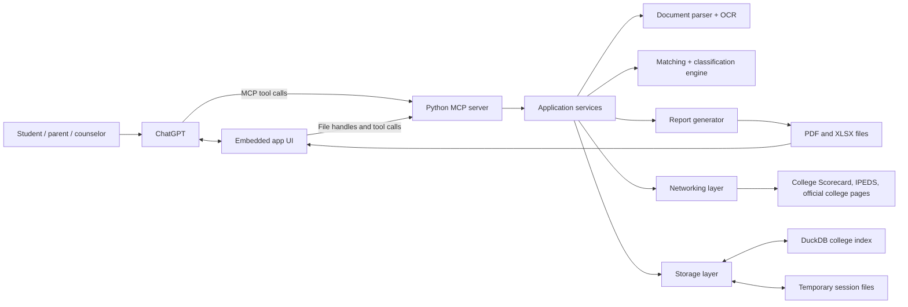

# US College Selection — Simple Architecture

**Version:** 1.1.0
**Status:** Proposed MVP architecture
**Last updated:** 2026-06-30

## 1. Architecture goal

Build the smallest useful ChatGPT app that can:

1. accept either a student transcript or manually entered grades and subjects, plus an optional résumé;
2. confirm a structured student profile;
3. search a local index of US colleges;
4. produce deterministic Safety / Likely, Target, and Reach classifications;
5. explain student-to-school gaps; and
6. export matching PDF and Excel reports.

The MVP should use free and open-source software plus free public data. It should not require a paid database, OCR service, ranking feed, analytics product, or separate OpenAI API integration.

## 2. Cost boundary

The application code and proposed dependencies are free to use. The design avoids server-side OpenAI API calls: ChatGPT invokes the app through MCP and explains structured results returned by the app.

Two external cost caveats remain:

- Access to ChatGPT is governed by the user's ChatGPT plan and current product availability.
- ChatGPT must reach the MCP server over public HTTPS. Local development can use a free tunnel, but a reliable production server may eventually require existing hardware or paid hosting if free hosting limits are insufficient.

The MVP must work locally before any hosted infrastructure is introduced.

## 3. Technology choices

| Area | Choice | Why |
|---|---|---|
| Language | Python 3.12+ | One language for MCP tools, data processing, OCR orchestration, classification, PDF, and Excel |
| Package management | `uv` | Fast, free, open-source Python environment and dependency management |
| ChatGPT integration | Official Python MCP SDK | Required tool interface for a ChatGPT app |
| HTTP layer | Starlette | Lightweight ASGI server for MCP and health endpoints |
| App UI | HTML, CSS, and TypeScript with Vite | Small embedded form and results table without a large UI framework |
| College database | DuckDB | Free embedded analytical database; handles bulk federal data efficiently |
| Validation | Pydantic | Typed tool inputs, outputs, and internal models |
| PDF parsing | `pypdf` | Extract text from text-based transcripts and résumés |
| PDF rendering | `pypdfium2` and Pillow | Render scanned PDF pages into images for OCR |
| OCR | Tesseract with `pytesseract` | Local, open-source OCR with no per-page charge |
| HTML parsing | `httpx` and Beautiful Soup | Fetch and parse official admissions pages when allowed |
| Excel export | `openpyxl` | Create formatted `.xlsx` workbooks |
| PDF export | ReportLab | Create local PDF reports without a paid rendering API |
| Tests | `pytest` and Playwright | Free unit, integration, and browser testing |
| Code quality | Ruff and mypy | Free linting, formatting, and type checking |

Not selected for the MVP:

- a paid vector database;
- a hosted OCR or document-intelligence API;
- a separate OpenAI API key or model call;
- proprietary college rankings;
- Redis, Kafka, or a background-job platform;
- a cloud database; or
- Docker as a requirement.

## 4. System overview



The MCP server owns facts, validation, classification, and exports. ChatGPT owns conversation, orchestration, and plain-language explanation. The embedded UI owns uploads, profile confirmation, tables, filters, and download buttons. All external HTTP access passes through the networking layer, and all database or filesystem access passes through the storage layer.

## 5. Components

### 5.1 Embedded ChatGPT UI

Responsibilities:

- choose transcript upload or manual academic entry;
- select or upload a transcript and optional résumé;
- add, edit, duplicate, and remove manual course rows;
- show extraction progress and validation errors;
- display extracted or manually entered fields for confirmation;
- collect preferences and optional budget;
- invoke the college-list workflow;
- render sortable and filterable results; and
- request PDF and Excel exports.

Use the MCP Apps bridge for normal tool calls. Use ChatGPT's file-handling extension for uploads and downloads where available. The current Apps SDK documents `uploadFile`, `selectFiles`, and `getFileDownloadUrl` for file handling, while recommending the MCP Apps bridge as the core integration.

Keep the UI stateless where practical. The canonical profile and result objects live in the MCP server for the duration of a session.

### 5.2 MCP server

The Python process exposes:

- `GET /` — simple health response;
- `/mcp` — stateless Streamable HTTP MCP endpoint; and
- a short-lived file-download route when a generated report cannot be returned through host file handling.

The server validates every tool request with Pydantic and returns `structuredContent` suitable for both ChatGPT and the UI.

Recommended public tools:

1. `analyze_student_documents`
   - Inputs: optional transcript handle and optional résumé handle.
   - Output: unconfirmed academic and activity profile with confidence and warnings.
2. `confirm_student_profile`
   - Inputs: reviewed extraction or manual academic record, plus preferences.
   - Output: canonical confirmed profile and session ID.
3. `build_college_list`
   - Inputs: confirmed profile and requested result count.
   - Output: candidate schools, classifications, reasons, gaps, sources, and warnings.
4. `export_report`
   - Inputs: session ID, selected schools, and `pdf`, `xlsx`, or both.
   - Output: downloadable generated files.

One user command—“Build my college list and gap analysis”—can let ChatGPT call these tools in sequence. The UI can call the same tools explicitly as the user confirms each step.

### 5.3 Networking layer

The networking layer is the only application package allowed to make outbound HTTP requests.

It provides a few concrete operations:

```text
download_file(url, destination)
get_text(url)
get_json(url)
```

Responsibilities:

- configure timeouts, retries, redirects, and the application user agent;
- stream large federal dataset downloads to disk;
- enforce allowed schemes and maximum response sizes;
- return response metadata such as status, URL, ETag, and retrieval time; and
- raise small, application-specific network errors.

The layer uses `httpx` internally. College parsing, classification, report generation, and MCP handlers must not import `httpx` or make requests directly.

### 5.4 Storage layer

The storage layer is the only application package allowed to open DuckDB or manage session files.

It contains two concrete components:

```text
CollegeStore      # public college data in DuckDB
SessionFileStore  # temporary uploads and generated reports
```

`CollegeStore` handles connections, transactions, schema creation, atomic refreshes, and read-only application queries. `SessionFileStore` creates random session directories, enforces paths and expiration, and deletes uploads and reports.

The rest of the application works with Pydantic models and ordinary method calls rather than SQL, DuckDB connections, or raw paths. Student data never enters `CollegeStore`.

This is intentionally not a generic repository framework: there are two implementations, no dependency-injection container, and no storage plug-in system. Tests may substitute small in-memory fakes where useful.

### 5.5 Academic intake pipeline

The two academic intake paths produce the same canonical student-profile schema. A transcript is never required when sufficient information is entered manually.

#### Transcript path

Processing sequence:

1. Verify the PDF file signature, MIME type, size, page count, and encryption state.
2. Copy the upload into a random, session-scoped temporary directory.
3. Reject transcripts over 15 pages or 15 MB and résumés over 6 pages or 10 MB.
4. Reject encrypted or password-protected PDFs with a clear user-facing error.
5. Extract embedded text with `pypdf`.
6. Render and OCR pages only when embedded text is absent or insufficient.
7. Normalize lines, tables, dates, course names, grades, and activities while preserving the original values.
8. Apply deterministic extraction rules.
9. Return extracted fields with source page, confidence, and warnings.
10. Require user confirmation before matching colleges.
11. Delete temporary originals after confirmation or session expiration.

Transcript extraction produces courses, grades, credits, GPA, rank, rigor, and grade trends. Résumé extraction produces activities, roles, dates, duration, time commitment, awards, work, service, projects, and skills.

The parser must never invent a value. Ambiguous values remain unconfirmed.

Each parsed course uses fields such as:

```text
course_name
subject
grade_level: 9 | 10 | 11 | 12
academic_year
term
grade_original
grade_scale
credits
course_level: REGULAR | HONORS | AP | IB | DUAL_ENROLLMENT | OTHER | UNKNOWN
course_level_original
course_level_source: TITLE | CODE | LEGEND | USER_CONFIRMED
course_level_confidence
```

Course-level detection follows explicit transcript evidence. A school-specific legend or course-code mapping takes precedence over title matching. Words such as `advanced` or `accelerated` do not automatically mean Honors, and the parser must not convert a course to AP without an explicit AP designation.

Represent GPA values as a list rather than one universal number:

```text
value
scale
type: WEIGHTED | UNWEIGHTED | UNKNOWN
scope: CUMULATIVE | YEAR | TERM | CORE
source: TRANSCRIPT | MANUAL | APP_CALCULATED
conversion_rule_version
```

Never modify a reported GPA by adding AP or Honors points. Any optional app-calculated comparison GPA is stored separately, is reproducible from a versioned conversion rule, and is never presented as the high school's GPA.

The confirmed profile also carries an applicant stage (`JUNIOR`, `SENIOR`, or `GAP_YEAR`), expected or actual graduation year, and academic-record as-of date. Junior profiles are not expected to contain senior-year work. Senior in-progress courses inform rigor but not completed-grade calculations. Gap-year profiles are expected to represent a completed high-school record and flag any remaining in-progress course for confirmation.

#### Manual path

The UI sends a structured academic record directly to `confirm_student_profile`. It supports:

- any number of courses across school years and terms;
- subject, course name, level, grade, grading scale, and credits;
- completed, repeated, withdrawn, pass/fail, and in-progress courses;
- optional GPA, rank, test scores, and grading notes; and
- partial records with explicit unknown values.

Validate field types and grade scales, but do not require GPA when course-level grades are available. Normalize manual and transcript-derived courses through the same code before matching. The confirmation screen shows completeness warnings and the effect of missing data on confidence.

### 5.6 College data pipeline

Use free public data:

- College Scorecard bulk data for institution, cost, admissions, completion, and outcome fields;
- NCES IPEDS data for institutional identity and additional official measures;
- institution-published Common Data Sets where readily available; and
- official admissions pages for current deadlines, policies, and program requirements.

The refresh command downloads bulk federal data, normalizes it, and replaces versioned DuckDB tables in one transaction:

```bash
uv run python -m app.data.refresh
```

Suggested core tables:

- `institutions`
- `programs`
- `admissions_profiles`
- `costs`
- `outcomes`
- `deadlines`
- `sources`
- `dataset_versions`

Do not fetch thousands of colleges during a user request. Search the local database first, then check official pages only for the 15–30 shortlisted institutions. Cache retrieved pages with source URL, retrieval time, and a content hash. Respect site terms, robots directives, rate limits, and request timeouts.

If a current deadline cannot be verified, return the official admissions link and mark the deadline `Unknown — verify with institution`.

### 5.7 Matching and classification engine

The engine is ordinary Python code, not an LLM prompt.

Pipeline:

1. Apply hard eligibility filters: active institution, four-year bachelor's offering, intended entry type, and confirmed user exclusions.
2. Match intended majors through CIP codes.
3. Compute academic position from available GPA, test, rigor, and rank data.
4. Apply selectivity safeguards, residency rules, and documented major restrictions.
5. Assign Safety / Likely, Target, Reach, or Insufficient Data.
6. Compute a separate fit score for preferences, cost, location, outcomes, and résumé themes.
7. Select a balanced 5–10 schools per category when supported by evidence.

Store rule explanations alongside the result:

```text
classification: REACH
confidence: HIGH
rules:
  - overall_admit_rate_below_20_percent
  - sat_within_middle_50_percent
missing:
  - major_specific_admit_rate
methodology_version: 1
```

Résumé information contributes only to the separate fit score and holistic context. It cannot silently override the academic/selectivity category.

GPA comparison rules:

- compare weighted values only when both student and college benchmark use a compatible weighted scale;
- compare unweighted values only with unweighted benchmarks;
- do not calculate a numeric GPA gap when the benchmark type or scale is unknown;
- lower confidence when compatible GPA data are unavailable; and
- score rigor separately from GPA using confirmed course levels, subject relevance, progression, and known school-course availability.

### 5.8 Report generator

Create a single canonical report model, then render both formats from it:

- ReportLab renders the printable PDF.
- `openpyxl` renders the five-sheet Excel workbook.

This prevents the UI, PDF, and Excel results from disagreeing.

Generated files live in the session temporary directory, use random names, and expire automatically. Spreadsheet text beginning with `=`, `+`, `-`, or `@` must be escaped when it originated from an uploaded document or external page.

## 6. Data ownership and session model

The zero-cost MVP does not require accounts.

- Generate a random session ID.
- Keep the confirmed profile, selected schools, and report model in session-scoped local storage.
- Store only the minimum metadata needed to reproduce the report.
- Delete uploads quickly after extraction and delete all session data after a configurable TTL, initially 24 hours.
- Provide a `delete_session` internal operation used by the UI's Delete button.
- Never write transcript or résumé contents to application logs.

DuckDB contains public college data only. Private student data must not be stored in the college database.

## 7. Repository structure

```text
USCollegeSelection/
├── app/
│   ├── server.py                 # ASGI and MCP entry point
│   ├── config.py
│   ├── tools/                    # MCP tool handlers
│   ├── networking/               # all outbound HTTP and downloads
│   ├── storage/                  # DuckDB and temporary file access
│   ├── documents/                # PDF, OCR, transcript, and résumé parsing
│   ├── colleges/                 # search, matching, classification, gap analysis
│   ├── data/                     # source mapping and normalization
│   ├── reports/                  # canonical report, PDF, and Excel renderers
│   ├── models/                   # Pydantic schemas
│   └── security/                 # validation, redaction, cleanup
├── web/
│   ├── src/                      # embedded HTML/TypeScript UI
│   └── public/
├── data/
│   ├── raw/                      # ignored; downloaded public datasets
│   └── college.duckdb            # ignored; generated local database
├── tests/
│   ├── fixtures/                 # synthetic, de-identified documents only
│   ├── unit/
│   └── integration/
├── scripts/
├── PRODUCT_SPEC.md
├── ARCHITECTURE.md
├── pyproject.toml
├── package.json
└── README.md
```

## 8. Local development

Expected commands:

```bash
uv sync
npm install
npm run build
uv run python -m app.data.refresh
uv run python -m app.server
```

The server listens on `http://localhost:8787/mcp`. Use the free MCP Inspector for local tool testing. ChatGPT testing requires exposing the endpoint through a public HTTPS tunnel and adding it as a connector in ChatGPT developer mode.

Do not commit downloaded datasets, generated reports, uploads, the DuckDB file, API keys, or tunnel credentials.

## 9. Testing strategy

Minimum automated coverage:

- networking timeouts, retries, response limits, and download metadata using mocked HTTP responses;
- storage schema creation, transactions, read-only queries, path safety, and session cleanup;
- a guard test that prevents `httpx` and `duckdb` imports outside their designated layers;
- document type, size, and malicious filename validation;
- text-based and scanned PDF extraction;
- rejection of non-PDF, encrypted, oversized, and over-page-limit uploads;
- transcript limits of 15 pages/15 MB and résumé limits of 6 pages/10 MB;
- transcript and résumé extraction against synthetic fixtures;
- transcript legends and course codes that identify Honors, AP, IB, and dual-enrollment courses;
- ambiguous `advanced` course titles that must remain `UNKNOWN` until confirmed;
- weighted, unweighted, unknown, and multiple reported GPA values;
- prevention of weighted-to-unweighted GPA comparisons;
- manual entry with one course, many courses, mixed grade scales, partial records, and unknown fields;
- equivalent normalization for the same record entered manually or extracted from a transcript;
- no-value-invention tests for ambiguous documents;
- deterministic classification snapshots;
- category-count behavior when fewer than five defensible matches exist;
- source freshness and conflict behavior;
- PDF generation and basic text verification;
- Excel sheet names, tables, formulas, links, and injection safety;
- deletion and TTL cleanup; and
- MCP tool input/output schema tests.

Never place real student documents in the repository or test suite.

## 10. Security baseline

- Allowlist upload types and verify file signatures.
- Use random server-side filenames and never execute uploaded content.
- Set conservative upload, page, OCR-time, and memory limits.
- Prevent archive expansion and path traversal.
- Sanitize extracted text before including it in logs or spreadsheets.
- Treat documents and college pages as untrusted data, not instructions.
- Bind local development to localhost by default.
- Keep secrets in environment variables and `.env` out of Git.
- Add rate limiting before exposing a persistent public endpoint.

## 11. Delivery stages

### Stage 1 — Offline vertical slice

Stage 1 is divided into milestones that can be implemented, tested, and reviewed independently:

```mermaid
flowchart LR
    M1["1.1 Project foundation"] --> M2["1.2 Student profile"]
    M2 --> M3["1.3 College data slice"]
    M3 --> M4["1.4 Classification"]
    M4 --> M5["1.5 Gap analysis"]
    M5 --> M6["1.6 PDF and Excel"]
    M6 --> M7["1.7 Offline demo"]
    M7 --> M8["1.8 Fit-ranked shortlist"]
    M8 --> M9["1.9 Granular CIP data"]
```



#### Milestone 1.1 — Project foundation

Deliverables:

- Create the Python package, `pyproject.toml`, and application directory structure.
- Add configuration, structured logging, and a local health command.
- Add the small networking and storage layer boundaries with test doubles.
- Configure Ruff, mypy, and pytest.
- Add `.gitignore` rules for datasets, DuckDB files, uploads, reports, and secrets.

Complete when a clean checkout can install dependencies and pass an initial test suite with one documented command.

#### Milestone 1.2 — Student profile and manual academics

Deliverables:

- Define Pydantic schemas for student preferences, GPA variants, tests, courses, grades, and course rigor.
- Support repeatable manual course rows and partial academic records.
- Preserve weighted, unweighted, unknown, and app-calculated GPA values separately.
- Return validation and completeness warnings without inventing missing values.

Complete when synthetic profiles covering a single course, multiple terms, AP/Honors courses, mixed GPA types, and missing fields validate predictably.

#### Milestone 1.3 — College data slice

Deliverables:

- Define the initial DuckDB schema and dataset-version metadata.
- Download and import the latest complete real College Scorecard institution dataset through the networking and storage layers.
- Retain only operating bachelor-or-higher institutions with positive undergraduate enrollment.
- Implement institution lookup, basic filters, cost fields, admissions fields, and source metadata.
- Add a refresh command that validates and replaces the real-data tables atomically.

Complete when the refresh command builds a validated database of eligible four-year institutions and tests can query a small frozen public-data fixture without network access.

#### Milestone 1.4 — Classification engine v1

Deliverables:

- Implement deterministic Safety / Likely, Target, Reach, and Insufficient Data rules.
- Compare only compatible GPA types and scales.
- Evaluate confirmed course rigor separately from GPA weighting.
- Return confidence, triggered rules, missing inputs, methodology version, and source dates.

Complete when a versioned test matrix covers category boundaries, highly selective schools, incompatible GPA data, and missing benchmarks.

Version 1 uses an explicit conservative rule set: an overall acceptance rate of 20% or lower forces Reach; Safety / Likely requires an acceptance rate of at least 50% and every compatible academic comparison above the published upper bound; a value below a published lower bound produces Reach; otherwise supported comparisons produce Target. Without a compatible academic comparison, the result is Insufficient Data unless the highly selective override applies. These constants are methodology-versioned rather than hidden in prompts.

Each result returns category, confidence, triggered rules, student values and school ranges used, missing inputs, excluded factors, source dates and URLs, methodology version, and a plain-language explanation. The UI and later reports render `missing_inputs` as a visible **Missing data** section and keep deliberately excluded evidence separate.

#### Milestone 1.5 — Gap analysis and report model

Deliverables:

- Create one canonical report model shared by every output format.
- Compare student academics, cost preference, and available school benchmarks.
- Produce strengths, gaps, unknowns, warnings, and source references.
- Include user-entered schools even when they fail matching preferences.

Complete when a saved report fixture contains reproducible results for at least one school in every classification category.

The canonical `CollegeReport` is the only input to later screen, PDF, and Excel renderers. It contains the confirmed profile, dataset provenance, generation time, methodology version, holistic context, disclaimer, and one `SchoolReport` per candidate. Each school report retains the institution and classification plus comparison rows, strengths, gaps, unknowns, warnings, and source references.

Academic rows carry the student value, published range, numeric distance to the nearest range boundary, status, and sources. Cost comparison follows the user's declared budget meaning: net-price budgets use average net price with a non-personalized warning, published-cost budgets prefer cost of attendance, and out-of-pocket budgets remain unknown until a student-specific estimate exists. A missing budget is visible but never penalizes a school. User-entered schools are deduplicated by UNITID but always retained even when a geography preference would normally filter them.

#### Milestone 1.6 — PDF and Excel exports

Deliverables:

- Generate the five-sheet Excel workbook with formatting, filters, links, and injection-safe text.
- Generate a printable PDF from the same canonical report model.
- Include generation time, methodology version, data years, and source links.
- Verify that PDF, Excel, and canonical report values agree.

Complete when automated tests inspect workbook structure, PDF text, and cross-format consistency.

Both renderers accept only the canonical `CollegeReport` and return bytes. They do not query DuckDB, call the network, or recalculate classifications. The export service publishes those bytes through `SessionFileStore`, which validates filenames, writes atomically into a private session directory, and applies owner-only permissions.

The Excel renderer uses seven core sheets plus a conditional qualified-college addendum, native tables and filters, frozen headers, typed dates/currency/percentages, bounded widths, hyperlinks, application-tracker validation, and formula-injection escaping for externally derived text. The PDF renderer uses repeating comparison headers, explicit page breaks, page numbers, print-safe colors, sources, methodology, generated time, missing data, warnings, and the report disclaimer. Automated tests compare school names and categories back to the canonical model; rendered sample artifacts receive visual inspection before the milestone is released.

#### Milestone 1.7 — Offline end-to-end demo

Deliverables:

- Add one CLI command that accepts the included example or another manual-profile JSON file.
- Use the full real local DuckDB database produced by the existing refresh command.
- Generate a classified college list, gap analysis, PDF, and Excel workbook.
- Document setup, demo usage, limitations, and expected output.

Complete when a clean checkout can perform one explicit real-data refresh and then run the documented demo locally without cloud hosting, paid services, private student data, or further network access. A frozen public fixture remains available only as an explicit automated-test mode.

The demo scans the local institution database, applies confirmed geographic preferences while retaining user-entered schools, classifies all matches, and returns up to ten schools per defensible category. It writes the canonical JSON report and matching PDF/XLSX files to a private local session directory. It never calls the networking layer; if the real database is absent, it instructs the user to run `refresh-data` rather than silently substituting test data.

#### Milestone 1.8 — Fit-ranked shortlist and holistic alignment

Deliverables:

- Replace first-in-database category truncation with a deterministic, versioned fit rank.
- Require one intended major and allow at most three in student-defined priority order; reject larger lists rather than silently truncating them.
- Rank each `student × institution × intended major` combination independently within Safety / Likely, Target, Reach, and Insufficient Data without changing the institution-level admissions classification.
- Add free federal program-of-study data using CIP codes so intended-major availability is a real school-specific signal.
- Represent confirmed résumé themes as structured holistic context rather than unscored prose.
- Use résumé themes only for program and opportunity alignment; never convert them into an invented admissions boost.
- Produce separate categorized lists for every intended major plus a consolidated multi-major view.
- Include major, component scores, missing inputs, score version, and a plain-language ranking explanation in JSON, PDF, and Excel.
- Preserve user-entered schools even when they fall outside the category cap or matching preferences.

The initial fit rank uses only transparent signals supported by free data: academic position within published ranges, intended-major availability, program and institution outcomes, stated cost and geography preferences, data completeness, and alignment between confirmed student themes and offered fields of study. The same institution may therefore rank differently for different majors. Admissions categories remain institution-level unless reliable major-specific selectivity is sourced; the fit rank must not imply that a university-wide acceptance rate is a program-specific admission rate. It does not claim to reproduce a proprietary national ranking or compare extracurricular strength against an unpublished admitted-student benchmark.

Complete when input order cannot affect shortlist order, the highest fit-ranked schools are selected within each category, every score is reproducible and explainable, résumé context cannot change a category, and missing data remains visible rather than being silently treated as zero.

#### Milestone 1.9 — Granular CIP program data

Deliverables:

- Ingest College Scorecard's four-digit bachelor field-of-study records for completion, earnings, and debt evidence.
- Ingest IPEDS Completions six-digit CIP records for exact bachelor-program availability.
- Match each intended major to reviewed six-, four-, and two-digit CIP codes.
- Use six-digit data to confirm availability, four-digit data for ranking outcomes, and two-digit institution shares only as a lower-confidence fallback.
- Show the availability CIP6, ranking CIP4, match granularity, source, and missing evidence in canonical JSON, PDF, and Excel outputs.
- Keep all downloads inside the explicit refresh workflow and all recommendation runs offline.

Complete when a real schema-version-3 refresh joins all three free federal sources by UNITID, exact programs can rank differently within their four-digit field, fallback confidence is explicit, and automated plus real-data smoke tests pass.

#### Milestone 1.10 — National major fit rank and admissions benchmarks

Deliverables:

- Keep the existing fit rank within each admissions category and label it explicitly.
- Add a student-specific national fit position for each intended major across US institutions with confirmed six-digit CIP availability.
- Add a separate national program-strength rank using major completions, field outcomes, and institution outcomes without student preferences or résumé evidence.
- Require an 80-point student-fit floor, select up to ten strongest programs per admissions category, and place all remaining qualified colleges in a report addendum.
- Show the national rank population and confidence; never describe the result as a published or commercial prestige rank.
- Add ACT composite 25th-to-75th percentile ranges to the main college table.
- Label admitted-student high-school GPA benchmarks as unavailable from the current official dataset unless a compatible sourced benchmark is present.
- Put student-supplied colleges in a separate ranked table before generated recommendations and retain unresolved names visibly.

Complete when national program-strength and student-fit ranks are deterministic across the full eligible institution universe, category ranks remain separate, the 80-point qualification floor is enforced without padding, supplied colleges are preserved, and JSON/PDF/XLSX include the qualified-college addendum and communicate source limitations consistently.

### Stage 2 — Documents

- Add text-based and scanned PDF extraction.
- Add image normalization and Tesseract OCR.
- Add transcript and résumé confirmation UI.
- Add privacy cleanup and file limits.

### Stage 3 — ChatGPT app

- Expose the four MCP tools.
- Build the embedded UI.
- Test through MCP Inspector and ChatGPT developer mode.
- Add file download handling.

### Stage 4 — Data quality

- Load the full federal dataset.
- Add CIP major matching.
- Add targeted official-page deadline checks.
- Add source freshness, conflicts, and confidence.

## 12. MVP architecture decisions

1. Use Python end to end on the server.
2. Use DuckDB instead of a hosted database.
3. Use local Tesseract instead of paid OCR.
4. Use deterministic parsing and require user confirmation.
5. Use deterministic classification; ChatGPT only explains it.
6. Use an internal fit rank instead of proprietary rankings.
7. Generate PDF and Excel locally from one report model.
8. Keep student data ephemeral and separate from public college data.
9. Start locally and introduce hosting only after the workflow is useful.

## 13. References

- [OpenAI Apps SDK quickstart](https://developers.openai.com/apps-sdk/quickstart)
- [OpenAI Apps SDK — MCP server and file handling](https://developers.openai.com/apps-sdk/build/mcp-server#understand-the-windowopenai-widget-runtime)
- [NCES IPEDS Data Center](https://nces.ed.gov/ipeds/datacenter/Default.aspx)
- [College Scorecard data](https://collegescorecard.ed.gov/data/)
- [Model Context Protocol Inspector](https://modelcontextprotocol.io/docs/tools/inspector)
